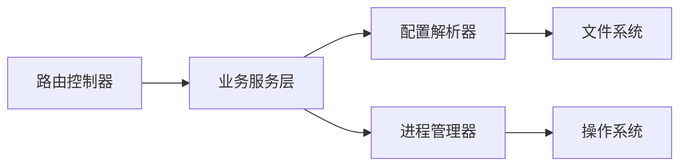

## 1. 架构设计
```mermaid
graph TB
    subgraph "客户端[用户浏览器]
        React[React前端应用]
    end
    
    subgraph "服务器端"
        Express[Express后端服务]
        FRPC[frpc进程管理]
        Config[frpc配置文件]
    end
    
    React -->|HTTP API| Express
    Express -->|读取/修改| Config
    Express -->|启动/停止/监控| FRPC
```

## 2. 技术描述
- 前端: React@18 + TypeScript + tailwindcss@3 + vite + zustand + react-router-dom + lucide-react
- 初始化工具: vite-init
- 后端: Express@4 + TypeScript
- 数据存储: 本地文件系统（frpc配置文件）

## 3. 路由定义
| 路由 | 用途 |
|------|------|
| / | 仪表盘页面 |
| /mappings | 端口映射管理页面 |
| /config | 配置文件管理页面 |

## 4. API定义

### 4.1 类型定义
```typescript
// 端口映射类型
interface PortMapping {
  id: string;
  name: string;
  localPort: number;
  remotePort: number;
  protocol: 'tcp' | 'udp';
  localIp?: string;
  status: 'active' | 'inactive';
}

// frpc服务状态
interface ServiceStatus {
  running: boolean;
  uptime?: number;
  version?: string;
}

// 配置文件内容
interface ConfigFile {
  path: string;
  content: string;
}
```

### 4.2 API端点
| 方法 | 路径 | 描述 |
|------|------|------|
| GET | /api/status | 获取frpc服务状态 |
| POST | /api/service/start | 启动frpc服务 |
| POST | /api/service/stop | 停止frpc服务 |
| POST | /api/service/restart | 重启frpc服务 |
| GET | /api/mappings | 获取所有端口映射 |
| POST | /api/mappings | 添加新的端口映射 |
| PUT | /api/mappings/:id | 更新端口映射 |
| DELETE | /api/mappings/:id | 删除端口映射 |
| GET | /api/config | 获取配置文件内容 |
| PUT | /api/config | 保存配置文件内容 |

## 5. 服务器架构图


## 6. 数据模型
本项目使用本地文件系统存储frpc配置文件，无需数据库。配置文件格式遵循frpc官方配置格式（INI或TOML）。
