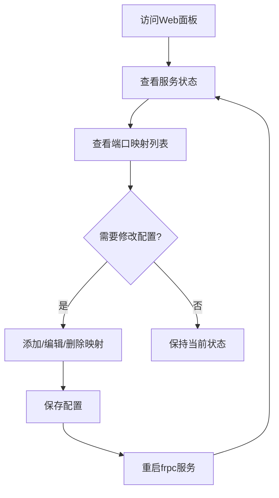

## 1. 产品概述
frpc Web管理面板是一个用于管理frpc端口映射和服务状态的Web应用程序，方便用户通过可视化界面配置和监控frpc服务。
- 主要解决frpc配置文件管理复杂、服务状态不直观的问题，目标用户为使用frpc进行内网穿透的服务器管理员
- 提供友好的Web界面，降低frpc的使用门槛，提高管理效率

## 2. 核心功能

### 2.1 用户角色
| 角色 | 注册方式 | 核心权限 |
|------|----------|----------|
| 管理员 | 本地部署，无需注册 | 完整的管理权限，包括配置修改、服务控制等 |

### 2.2 功能模块
1. **服务状态仪表盘**: 显示frpc服务运行状态、端口映射列表、系统信息
2. **端口映射管理**: 添加、编辑、删除端口映射配置，自动识别现有配置
3. **配置文件管理**: 查看和编辑frpc配置文件
4. **服务控制**: 启动、停止、重启frpc服务

### 2.3 页面详情
| 页面名称 | 模块名称 | 功能描述 |
|---------|---------|---------|
| 仪表盘 | 服务状态卡片 | 显示frpc服务运行状态（在线/离线）、运行时间、连接数 |
| 仪表盘 | 端口映射列表 | 表格展示所有端口映射，包括本地端口、远程端口、协议、状态 |
| 端口映射管理 | 添加映射表单 | 表单形式添加新的端口映射配置 |
| 端口映射管理 | 编辑映射 | 支持修改现有映射配置 |
| 配置管理 | 配置文件查看 | 展示当前frpc配置文件内容 |
| 配置管理 | 配置文件编辑 | 可编辑并保存配置文件 |
| 服务控制 | 操作按钮 | 提供启动、停止、重启frpc服务的按钮 |

## 3. 核心流程
用户访问Web面板 → 查看服务状态和端口映射列表 → 添加/编辑/删除端口映射 → 保存配置 → 重启frpc服务使配置生效

## 4. 用户界面设计
### 4.1 设计风格
- 主色调：深蓝色 (#1e40af) 搭配青色 (#06b6d4)
- 按钮风格：圆角按钮，带有轻微阴影，hover时有色彩过渡动画
- 字体：使用现代无衬线字体，标题使用较大字号和粗体
- 布局风格：卡片式布局，顶部导航栏
- 图标风格：简洁的线性图标，使用lucide-react图标库

### 4.2 页面设计概述
| 页面名称 | 模块名称 | UI元素 |
|---------|---------|--------|
| 仪表盘 | 服务状态卡片 | 大尺寸状态指示器，绿色表示在线，红色表示离线，卡片有微妙的渐变背景 |
| 仪表盘 | 端口映射列表 | 斑马纹表格，状态列使用颜色标签，hover时行有高亮效果 |
| 端口映射管理 | 表单 | 卡片式表单，输入框有聚焦效果，提交按钮有加载状态 |
| 配置管理 | 配置编辑器 | 代码高亮显示区域，有语法高亮，编辑时有撤销/重做功能 |

### 4.3 响应性
- 桌面端优先设计，适配常见的1080p/2K/4K分辨率
- 移动端自适应布局，表格在小屏幕上可横向滚动
- 触摸优化，按钮和输入框在移动端有合适的点击区域

### 4.4 3D场景指导
本项目不涉及3D场景
